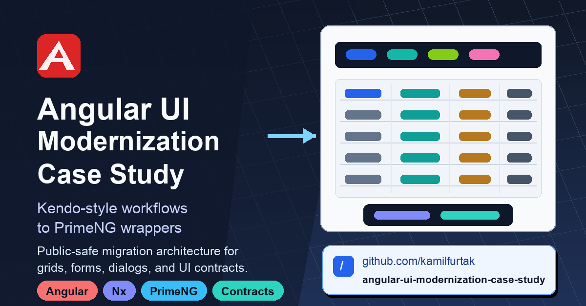
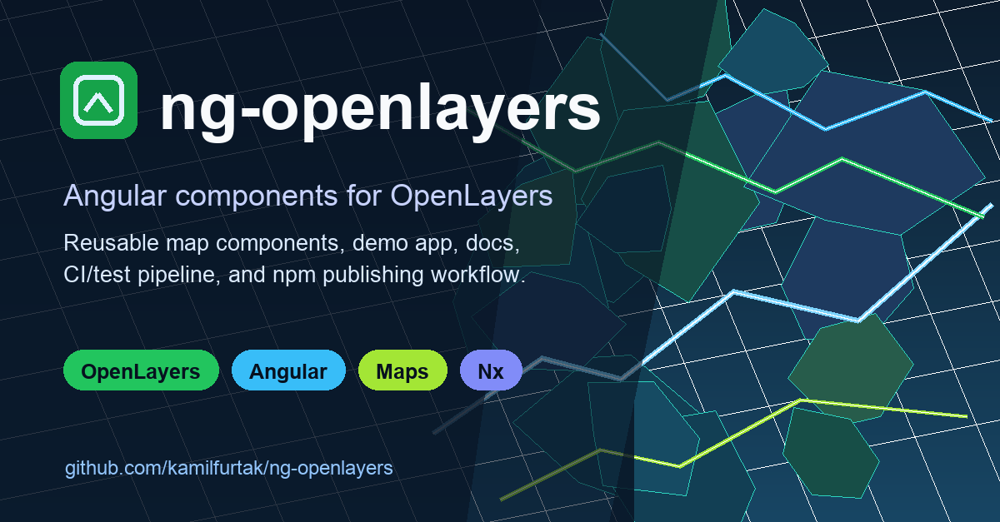

# Kamil Furtak

Senior Angular Engineer focused on enterprise frontend modernization, Angular architecture, geospatial systems, reusable UI libraries, and practical developer tooling.

I specialize in Angular, TypeScript, RxJS, Nx monorepos, Kendo UI, PrimeNG, OpenLayers, and frontend architecture. I also work around the integration and tooling layers that make large applications successful: Java/Spring, C#/.NET, NestJS/Node.js, PHP/Symfony, SAML, SOAP/WSDL, certificates, OpenAPI, Firebase/PWA flows, runtime tooling, and AI-assisted engineering workflows.

## Current Focus

- Modernizing mature Angular applications without risky rewrites.
- Designing reusable UI contracts, migration boundaries, and PrimeNG/Kendo-style compatibility layers.
- Building dense operational interfaces with grids, forms, dialogs, files, maps, and shared state.
- Using Nx, MCP-style tools, repository-specific rules, coding agents, and code-generation evaluation to improve developer feedback loops.
- Keeping AI-assisted development grounded in review, tests, accessibility checks, production builds, and browser verification.

## Featured Work

### Enterprise Angular UI Modernization

A public-safe case study for preserving Kendo-style enterprise workflows while moving rendering behind neutral contracts, compatibility adapters, and PrimeNG-backed wrappers.

- Angular/Nx architecture for reusable UI libraries.
- Migration coverage across grids, toolbars, dialogs, forms, files, maps, messages, and workflow state.
- Validation evidence: source audits, production build, browser verification, and no console errors in proof flows.

[Repository](https://github.com/kamilfurtak/angular-ui-modernization-case-study)

### ng-openlayers

Declarative OpenLayers components for Angular.

Public Angular/OpenLayers library with a GitHub Pages demo, npm publishing workflow, and examples for map layers, sources, features, styles, controls, interactions, overlays, and geospatial UI composition.

- [Repository](https://github.com/kamilfurtak/ng-openlayers)
- [Demo](https://kamilfurtak.github.io/ng-openlayers/)
- [Tutorial](https://medium.com/@kamilfurtak/create-interactive-maps-with-angular-17-and-latest-openlayers-7ae9b7fdb7ec)

## Broader Engineering Work

### Cross-stack integration

Hands-on production exposure and self-directed prototypes around Angular clients, NestJS/Node.js APIs, ASP.NET Core/.NET services, Java Spring clients, SAML, certificates, SOAP/WSDL services, Swagger/OpenAPI, generated TypeScript contracts, authentication request generation, artifact resolution, and response validation.

### Developer tooling and AI-assisted workflows

MCP/Nx tooling, Angular/Kendo/Formly code analysis, grid/form generation, legacy-to-Angular mapping, import repair, repository-specific coding rules, code-review assistance, local LLM and coding-agent experiments, and build/accessibility repair workflows.

### Product-style Angular prototypes

Self-directed Angular/Nx prototypes using standalone components, signal-oriented state, Firebase anonymous auth, Firestore persistence, PWA/Firebase hosting experiments, API proxy/integration work, AI-assisted image analysis with structured outputs, domain dashboards, transaction/profit analysis, and Cypress component tests.

## What I Bring

- Deep Angular/TypeScript experience with senior-level ownership of frontend architecture.
- Strong migration thinking for mature enterprise systems, not only greenfield component work.
- Reusable library design across grids, toolbars, dialogs, forms, maps, files, and workflow state.
- Geospatial UI experience with Angular and OpenLayers.
- Practical cross-stack integration awareness around identity, certificates, APIs, and generated contracts.
- AI-assisted developer tooling used with explicit validation, not as a substitute for engineering judgment.

## Links

- [LinkedIn](https://linkedin.com/in/kamilfurtak)
- [GitHub](https://github.com/kamilfurtak)
- [Medium](https://medium.com/@kamilfurtak)
