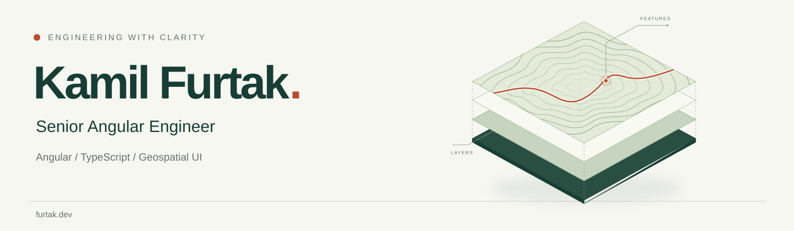

<picture>
  <source media="(prefers-color-scheme: dark)" srcset="assets/profile-banner-dark.svg">
  <source media="(prefers-color-scheme: light)" srcset="assets/profile-banner-light.svg">
  
</picture>

**I make complex frontends easier to use and easier to change.**

Senior Angular Engineer focused on enterprise UI modernization, reusable libraries and geospatial interfaces. My core toolkit is **Angular, TypeScript, RxJS, Nx and OpenLayers**.

[Portfolio & work samples](https://furtak.dev/) · [LinkedIn / contact](https://linkedin.com/in/kamilfurtak)

## Start with the Angular work

### [ng-openlayers](https://github.com/kamilfurtak/ng-openlayers)

**Maps, the Angular way.** A published library for composing OpenLayers maps with Angular components. My maintainer work covers API compatibility, releases, component lifecycle ownership and geospatial examples.

[Live examples](https://ng-openlayers.furtak.dev/) · [npm package](https://www.npmjs.com/package/ng-openlayers) · [Source & validation](https://github.com/kamilfurtak/ng-openlayers/blob/master/docs/validation.md)

### [Angular UI modernization](https://furtak.dev/angular-ui-modernization-case-study/)

**A new UI. The same workflow.** Replace a native table with PrimeNG without losing search, sorting, selection or a draft. A small independent workbench with typed state, controlled failures and regression tests.

[Try the workbench](https://furtak.dev/angular-ui-modernization-case-study/) · [Code, tests & design decisions](https://github.com/kamilfurtak/kamilfurtak.github.io/tree/main/reference-sources/angular-ui-modernization-case-study/demo)

The public sample uses synthetic data and was developed with AI assistance. It is separate from the broader private case study and contains no employer code.

## Contributing back

Selected changes accepted by other open-source projects:

- **[bolt.diy #1322](https://github.com/stackblitz-labs/bolt.diy/pull/1322)** — model search and selector improvements.
- **[Hindsight #3656](https://github.com/vectorize-io/hindsight/pull/3656)** — strict-schema configuration consistency with regression tests.

## Beyond the interface

- **[local-model-bridge (archived)](https://github.com/kamilfurtak/kamilfurtak.github.io/tree/main/reference-sources/local-model-bridge)** — experimental developer tooling with HTTP/SSE handling, setup checks and cross-platform tests. [Validation & compatibility boundaries](https://github.com/kamilfurtak/kamilfurtak.github.io/blob/main/reference-sources/local-model-bridge/docs/validation.md).
- **[Identity integration](https://furtak.dev/epuap-login-gov-integration-portfolio/)** — a static architecture walkthrough of frontend/API boundaries, SAML, SOAP/WSDL and generated contracts. It is not a live login.gov/ePUAP service or a public backend implementation.

## How I work

Keep contracts typed. Preserve behavior during migrations. Test lifecycle, error and persistence boundaries. I use AI tools to support implementation, while retaining responsibility for design, source review and verification.

[Read my Angular & OpenLayers article](https://furtak.dev/articles/angular-openlayers/) · [Get in touch](https://linkedin.com/in/kamilfurtak)
